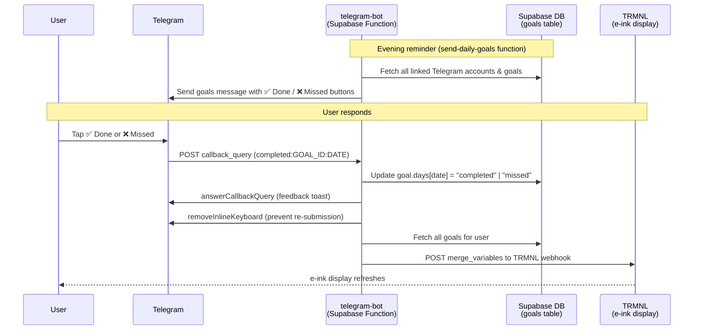
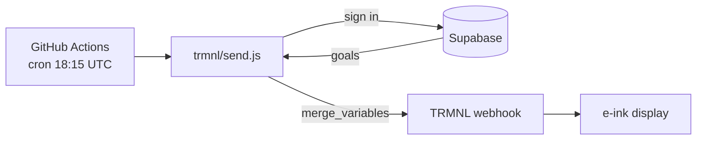
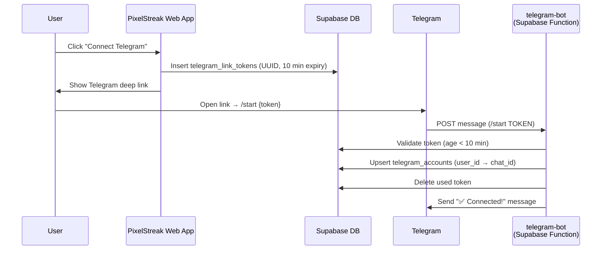

# PixelStreak Workflow

## Goal Tracking via Telegram → TRMNL

```mermaid
sequenceDiagram
    participant U as User
    participant TG as Telegram
    participant BF as telegram-bot<br/>(Supabase Function)
    participant DB as Supabase DB<br/>(goals table)
    participant TR as TRMNL<br/>(e-ink display)

    Note over BF,DB: Evening reminder (send-daily-goals function)
    BF->>DB: Fetch all linked Telegram accounts & goals
    BF->>TG: Send goals message with ✅ Done / ❌ Missed buttons

    Note over U,TR: User responds
    U->>TG: Tap ✅ Done or ❌ Missed
    TG->>BF: POST callback_query (completed:GOAL_ID:DATE)
    BF->>DB: Update goal.days[date] = "completed" | "missed"
    BF->>TG: answerCallbackQuery (feedback toast)
    BF->>TG: removeInlineKeyboard (prevent re-submission)
    BF->>DB: Fetch all goals for user
    BF->>TR: POST merge_variables to TRMNL webhook
    TR-->>U: e-ink display refreshes
```

## Scheduled TRMNL Sync (fallback)

```mermaid
flowchart LR
    GH[GitHub Actions\ncron 18:15 UTC] --> S[trmnl/send.js]
    S -->|sign in| SB[(Supabase)]
    SB -->|goals| S
    S -->|merge_variables| TR[TRMNL webhook]
    TR --> D[e-ink display]
```

## Account Linking

```mermaid
sequenceDiagram
    participant U as User
    participant App as PixelStreak Web App
    participant DB as Supabase DB
    participant TG as Telegram
    participant BF as telegram-bot<br/>(Supabase Function)

    U->>App: Click "Connect Telegram"
    App->>DB: Insert telegram_link_tokens (UUID, 10 min expiry)
    App->>U: Show Telegram deep link
    U->>TG: Open link → /start {token}
    TG->>BF: POST message (/start TOKEN)
    BF->>DB: Validate token (age < 10 min)
    BF->>DB: Upsert telegram_accounts (user_id → chat_id)
    BF->>DB: Delete used token
    BF->>TG: Send "✅ Connected!" message
```
